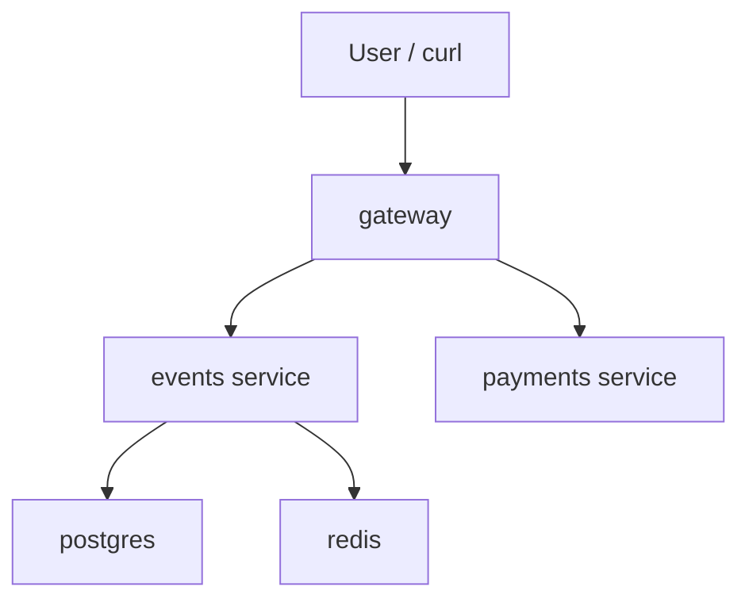

# Lab 1 — SRE Philosophy: Deploy, Break, Understand

# Task 1 - Deploy & Break QuickTicket

## 1.1: Docker Compose Status

```bash
~/SRE-Intro/app feature/lab1 ❯ docker compose ps -a
```

```text
NAME             IMAGE                COMMAND                  SERVICE    CREATED          STATUS                    PORTS
app-events-1     app-events           "uvicorn main:app --…"   events     11 seconds ago   Up 5 seconds              0.0.0.0:8081->8081/tcp, [::]:8081->8081/tcp
app-gateway-1    app-gateway          "uvicorn main:app --…"   gateway    11 seconds ago   Up 5 seconds              0.0.0.0:3080->8080/tcp, [::]:3080->8080/tcp
app-payments-1   app-payments         "uvicorn main:app --…"   payments   11 seconds ago   Up 10 seconds             0.0.0.0:8082->8082/tcp, [::]:8082->8082/tcp
app-postgres-1   postgres:17-alpine   "docker-entrypoint.s…"   postgres   11 seconds ago   Up 10 seconds (healthy)   0.0.0.0:5432->5432/tcp, [::]:5432->5432/tcp
app-redis-1      redis:7-alpine       "docker-entrypoint.s…"   redis      11 seconds ago   Up 10 seconds (healthy)   0.0.0.0:6379->6379/tcp, [::]:6379->6379/tcp
```

All five required services are running:

- `gateway`
- `events`
- `payments`
- `postgres`
- `redis`

---

## 1.2: Verify the System Works

### List events

```bash
~/SRE-Intro/app feature/lab1 ❯ curl -s http://localhost:3080/events | python3 -m json.tool
```

```json
[
    {
        "id": 1,
        "name": "Go Conference 2026",
        "venue": "Main Hall A",
        "date": "2026-09-15T09:00:00+00:00",
        "total_tickets": 100,
        "price_cents": 5000,
        "available": 100
    },
    {
        "id": 4,
        "name": "Python Workshop",
        "venue": "Lab 301",
        "date": "2026-09-22T14:00:00+00:00",
        "total_tickets": 25,
        "price_cents": 2000,
        "available": 25
    },
    {
        "id": 2,
        "name": "SRE Meetup",
        "venue": "Room 204",
        "date": "2026-10-01T18:00:00+00:00",
        "total_tickets": 30,
        "price_cents": 0,
        "available": 30
    },
    {
        "id": 5,
        "name": "Kubernetes Deep Dive",
        "venue": "Auditorium B",
        "date": "2026-10-10T10:00:00+00:00",
        "total_tickets": 80,
        "price_cents": 8000,
        "available": 80
    },
    {
        "id": 3,
        "name": "Cloud Native Summit",
        "venue": "Expo Center",
        "date": "2026-11-20T10:00:00+00:00",
        "total_tickets": 500,
        "price_cents": 15000,
        "available": 500
    }
]
```

### Reserve ticket

```bash
~/SRE-Intro/app feature/lab1 ❯ curl -s -X POST http://localhost:3080/events/1/reserve \
  -H "Content-Type: application/json" \
  -d '{"quantity": 1}' | python3 -m json.tool
```

```json
{
    "reservation_id": "cf4d8ccc-2b57-403a-ae5d-81519524ead9",
    "event_id": 1,
    "quantity": 1,
    "total_cents": 5000,
    "expires_in_seconds": 300
}
```

### Pay reservation

The payment request must use a real `reservation_id` returned by the reserve endpoint.

```bash
~/SRE-Intro/app feature/lab1 ❯ curl -s -X POST http://localhost:3080/reserve/e6614cde-0ec2-4b4e-b63d-ab9f3d493f3c/pay | python3 -m json.tool
```

```json
{
    "order_id": "e6614cde-0ec2-4b4e-b63d-ab9f3d493f3c",
    "event_id": 1,
    "quantity": 1,
    "total_cents": 5000,
    "status": "confirmed"
}
```

> Note: the earlier request with `RESERVATION_ID_HERE` was not a valid critical-path check, because it used a placeholder instead of a real reservation id.

### Health check

```bash
~/SRE-Intro/app feature/lab1 ❯ curl -s http://localhost:3080/health | python3 -m json.tool
```

```json
{
    "status": "healthy",
    "checks": {
        "events": "ok",
        "payments": "ok",
        "circuit_payments": "CLOSED"
    }
}
```

The system is healthy when all services are running.

---

## 1.3: Read the Architecture

### Dependency map



### Dependency chains

```text
gateway → events → postgres
gateway → events → redis
gateway → payments
```

### Which service calls which?

The `gateway` service acts as the main entry point to the system. All user requests go through `gateway` on `localhost:3080`; users do not interact with the internal services directly.

For event-related operations, `gateway` forwards requests to the `events` service. This includes listing events, getting information about a specific event, creating a ticket reservation, and confirming a reservation after payment.

For the checkout flow, `gateway` calls the `payments` service. When a user pays for a reservation, `gateway` sends a charge request to `payments`. If the charge succeeds, `gateway` then calls `events` again to confirm the reservation and create the final order.

The `events` service depends on two backend storage components. It uses `postgres` to store persistent data such as events, ticket availability, and confirmed orders. It uses `redis` to store temporary reservations, reservation TTLs, and held ticket counters.

The `payments` service is isolated from the storage layer. It does not call `postgres`, `redis`, or any other internal service. Its role is to simulate payment processing and return a payment reference when the charge succeeds.

### What happens if a dependency is down?

| Dependency down | Expected system behavior | User impact |
|---|---|---|
| `payments` | The system can still show events and create reservations, but the checkout request fails because `gateway` cannot successfully call the payment processor. | Users can browse events and reserve tickets, but they cannot complete payment. |
| `events` | `gateway` loses access to the main ticketing service. Event listing, reservation creation, and reservation confirmation become unavailable. | Most of the application becomes unusable from the user's point of view. |
| `postgres` | The `events` service cannot reliably load event data, calculate ticket availability, or persist confirmed orders. | Event listing, reservation creation, and order confirmation may fail. |
| `redis` | The `events` service cannot reliably store or retrieve temporary reservations. | Users may still be able to view events, but the reservation and payment confirmation flow becomes unreliable. |

---

## 1.4: Systematic Failure Exploration

For each experiment, one component was stopped and the main user-facing endpoints were checked.

### Failure case: `payments` down

When the `payments` service was stopped, the ticket browsing and reservation flow continued to work. The user could still call `GET /events` and create a reservation through `POST /events/1/reserve`.

The checkout flow failed because `gateway` could not reach the payment processor. The user saw:

```json
{
    "detail": "Payment service unavailable"
}
```

The health endpoint reflected the problem correctly. It reported the system as `degraded`, with `events` still `ok` and `payments` marked as `down`.

### Failure case: `events` down

When the `events` service was stopped, the main ticketing functionality became unavailable. Event listing and reservation creation both failed because `gateway` could not reach the service responsible for ticket data and reservations.

The user saw:

```json
{
    "detail": "Events service unavailable"
}
```

A payment request could still reach the `payments` service, but the full checkout flow could not be completed because the reservation confirmation step depends on `events`. The user saw:

```json
{
    "detail": "Payment succeeded but confirmation failed — contact support"
}
```

The health endpoint reflected the problem correctly and reported `events` as `down`, while `payments` stayed `ok`.

### Failure case: `redis` down

When `redis` was stopped, event listing still worked because event data is stored in `postgres`. However, reservation creation failed because temporary reservations and held ticket counters depend on `redis`.

The user saw:

```json
{
    "detail": "Events service timeout"
}
```

A payment flow could not be completed reliably because reservation confirmation depends on reservation data that is normally stored in `redis`.

The health endpoint reflected the issue by reporting the system as `degraded`. From the `gateway` perspective, the `events` dependency became unavailable or unhealthy while `payments` remained `ok`.

### Failure case: `postgres` down

When `postgres` was stopped, the `events` service could no longer read persistent event data or create confirmed orders. Event listing failed with:

```json
{
    "detail": "Events service unavailable"
}
```

Reservation creation also failed. In this case, the response could not be parsed by `json.tool`, which means the user received an empty or non-JSON error response from the gateway/upstream service while the database was unavailable.

Payment could still reach the `payments` service, but final order confirmation failed because `events` could not complete the confirmation without `postgres`.

The health endpoint reflected the issue and reported the system as `degraded`, with `events` marked as `degraded` and `payments` still `ok`.

### Failure table

| Component Killed | Events List | Reserve | Pay | Health Check | User Impact |
|-----------------|-------------|---------|-----|--------------|-------------|
| `payments` | OK — returned the list of events | OK — reservation was created | Failed — `Payment service unavailable` | `degraded`, `payments: down`, `events: ok` | Users can browse events and reserve tickets, but cannot complete payment. |
| `events` | Failed — `Events service unavailable` | Failed — `Events service unavailable` | Failed — `Payment succeeded but confirmation failed — contact support` | `degraded`, `events: down`, `payments: ok` | Most user-facing functionality is unavailable. Users cannot browse events, reserve tickets, or confirm paid reservations. |
| `redis` | OK — returned the list of events | Failed — `Events service timeout` | Failed / unreliable — reservation confirmation cannot be completed reliably | `degraded`, `events: down`, `payments: ok` | Users can still browse events, but reservations cannot be reliably created or confirmed. |
| `postgres` | Failed — `Events service unavailable` | Failed — non-JSON/empty response while parsing with `json.tool` | Failed — `Payment succeeded but confirmation failed — contact support` | `degraded`, `events: degraded`, `payments: ok` | Event listing, reservation creation, and order confirmation are affected because persistent ticket data is unavailable. |

---

## 1.5: Run the Load Generator

I ran the load generator with 5 requests per second for 30 seconds.

### Baseline run

During the first run, all services were healthy.

```text
QuickTicket Load Generator
Target: http://localhost:3080 | RPS: 5 | Duration: 30s
---
[10s] requests=45 success=45 fail=0 error_rate=0%
[10s] requests=46 success=46 fail=0 error_rate=0%
[10s] requests=47 success=47 fail=0 error_rate=0%
[10s] requests=48 success=48 fail=0 error_rate=0%
[10s] requests=49 success=49 fail=0 error_rate=0%
[20s] requests=92 success=92 fail=0 error_rate=0%
[20s] requests=93 success=93 fail=0 error_rate=0%
[20s] requests=94 success=94 fail=0 error_rate=0%
[20s] requests=95 success=95 fail=0 error_rate=0%
---
Done. total=137 success=137 fail=0 error_rate=0%
```

Baseline result:

```text
total=137 success=137 fail=0 error_rate=0%
```

This shows that the system handled the baseline load successfully when all services were healthy.

### Load run with `payments` killed

During the second run, I started the load generator again and stopped the `payments` service while the load test was still running.

```text
QuickTicket Load Generator
Target: http://localhost:3080 | RPS: 5 | Duration: 30s
---
[10s] requests=47 success=47 fail=0 error_rate=0%
[10s] requests=48 success=48 fail=0 error_rate=0%
[10s] requests=49 success=49 fail=0 error_rate=0%
[10s] requests=50 success=50 fail=0 error_rate=0%
[10s] requests=51 success=51 fail=0 error_rate=0%
[20s] requests=94 success=94 fail=0 error_rate=0%
[20s] requests=95 success=95 fail=0 error_rate=0%
[20s] requests=96 success=96 fail=0 error_rate=0%
[20s] requests=97 success=97 fail=0 error_rate=0%
[20s] requests=98 success=98 fail=0 error_rate=0%
---
Done. total=140 success=135 fail=5 error_rate=3.5%
```

Failure run result:

```text
total=140 success=135 fail=5 error_rate=3.5%
```

The error rate increased from `0%` to `3.5%` after the `payments` service was stopped.

This shows that the `payments` service failure does not bring the whole system down. Non-payment requests can still succeed, but checkout-related requests fail while the payment processor is unavailable.

After starting `payments` again, the health endpoint returned to a healthy state:

```json
{
    "status": "healthy",
    "checks": {
        "events": "ok",
        "payments": "ok",
        "circuit_payments": "CLOSED"
    }
}
```
 
# Task 2 — Graceful Degradation
## 1.7–1.8: Graceful Degradation

### Gateway change diff

```diff
diff --git a/app/gateway/main.py b/app/gateway/main.py
index c86db33..db120b7 100644
--- a/app/gateway/main.py
+++ b/app/gateway/main.py
@@ -331,14 +331,45 @@ async def pay_reservation(reservation_id: str):
         payment_ref = pay_resp.json().get("payment_ref", "unknown")
     except CircuitOpenError:
         log.error("circuit open, skipping payments call")
-        raise HTTPException(503, "Payment service temporarily unavailable (circuit open)")
+        return JSONResponse(
+            status_code=503,
+            content={
+                "error": "payments_unavailable",
+                "message": "Payment service is temporarily down. Your reservation is held — try again in a few minutes.",
+                "reservation_id": reservation_id,
+            },
+        )
     except httpx.TimeoutException:
-        raise HTTPException(504, "Payment service timeout")
+        return JSONResponse(
+            status_code=503,
+            content={
+                "error": "payments_unavailable",
+                "message": "Payment service is temporarily down. Your reservation is held — try again in a few minutes.",
+                "reservation_id": reservation_id,
+            },
+        )
     except httpx.HTTPStatusError as e:
         raise HTTPException(e.response.status_code, "Payment failed")
+    except httpx.RequestError as e:
+        log.error(f"payment service unavailable: {e}")
+        return JSONResponse(
+            status_code=503,
+            content={
+                "error": "payments_unavailable",
+                "message": "Payment service is temporarily down. Your reservation is held — try again in a few minutes.",
+                "reservation_id": reservation_id,
+            },
+        )
     except Exception as e:
         log.error(f"payment error: {e}")
-        raise HTTPException(502, "Payment service unavailable")
+        return JSONResponse(
+            status_code=503,
+            content={
+                "error": "payments_unavailable",
+                "message": "Payment service is temporarily down. Your reservation is held — try again in a few minutes.",
+                "reservation_id": reservation_id,
+            },
+        )
 
     # 2. Confirm reservation in events.
     try:
```

### Verification with `payments` down

I stopped the `payments` service and verified that reservation still works, while payment returns a clear `503` response.

#### Reserve still works

```bash
curl -s -X POST http://localhost:3080/events/1/reserve \
  -H "Content-Type: application/json" \
  -d '{"quantity": 1}'
```

Output:

```json
{
    "reservation_id": "e459db3c-9ad3-4e26-b9f7-bcc7ba8ef43f",
    "event_id": 1,
    "quantity": 1,
    "total_cents": 5000,
    "expires_in_seconds": 300
}
```

#### Pay returns clear 503

```bash
curl -i -s -X POST http://localhost:3080/reserve/e459db3c-9ad3-4e26-b9f7-bcc7ba8ef43f/pay
```

Output:

```http
HTTP/1.1 503 Service Unavailable
date: Sun, 07 Jun 2026 10:47:57 GMT
server: uvicorn
content-length: 194
content-type: application/json

{"error":"payments_unavailable","message":"Payment service is temporarily down. Your reservation is held — try again in a few minutes.","reservation_id":"e459db3c-9ad3-4e26-b9f7-bcc7ba8ef43f"}
```

# Task 3 — GitHub Community Engagement

Starring repositories is useful because it is not only a personal bookmark, but also a small signal of trust and interest for the open-source community. When many developers star a project, it becomes easier for others to discover it, evaluate its relevance, and understand that the tool may be worth exploring.

Following developers helps me stay connected with people whose work is relevant to my learning and future projects. In team projects, it makes it easier to track contributions, discover useful repositories, understand how experienced developers structure their work, and build professional connections over time.

# Bonus Task — Resource Usage Under Load

## B.1: Baseline idle stats

I captured container resource usage while all QuickTicket services were running, but the system was not receiving active traffic.

```text
NAME             CPU %     MEM USAGE / LIMIT     NET I/O           PIDS
app-gateway-1    0.14%     38.21MiB / 31.07GiB   13.3kB / 9.9kB    2
app-payments-1   0.13%     33.61MiB / 31.07GiB   3.7kB / 727B      2
app-events-1     0.12%     41.08MiB / 31.07GiB   14.6kB / 8.79kB   2
app-postgres-1   0.00%     24.2MiB / 31.07GiB    217kB / 247kB     8
app-redis-1      0.34%     3.781MiB / 31.07GiB   67.7kB / 25.5kB   6
```

At rest, all services used very little CPU. The largest memory consumer was `events`, with about `41.08MiB`.

## B.2: Resource usage under load

I then ran the load generator at 10 requests per second for 30 seconds.

```text
QuickTicket Load Generator
Target: http://localhost:3080 | RPS: 10 | Duration: 30s
---
[10s] requests=89 success=89 fail=0 error_rate=0%
[10s] requests=90 success=90 fail=0 error_rate=0%
[10s] requests=91 success=91 fail=0 error_rate=0%
[10s] requests=92 success=92 fail=0 error_rate=0%
[10s] requests=93 success=93 fail=0 error_rate=0%
[10s] requests=94 success=94 fail=0 error_rate=0%
[10s] requests=95 success=95 fail=0 error_rate=0%
[10s] requests=96 success=96 fail=0 error_rate=0%
[20s] requests=177 success=171 fail=6 error_rate=3.3%
[20s] requests=178 success=172 fail=6 error_rate=3.3%
[20s] requests=179 success=173 fail=6 error_rate=3.3%
[20s] requests=180 success=174 fail=6 error_rate=3.3%
[20s] requests=181 success=175 fail=6 error_rate=3.3%
[20s] requests=182 success=176 fail=6 error_rate=3.2%
[20s] requests=183 success=177 fail=6 error_rate=3.2%
[20s] requests=184 success=178 fail=6 error_rate=3.2%
---
Done. total=263 success=241 fail=22 error_rate=8.3%
```

While the load test was running, I captured the resource usage:

```text
NAME             CPU %     MEM USAGE / LIMIT     NET I/O           PIDS
app-gateway-1    3.35%     39.49MiB / 31.07GiB   244kB / 233kB     2
app-payments-1   0.40%     34.28MiB / 31.07GiB   12.4kB / 6.51kB   2
app-events-1     1.84%     42MiB / 31.07GiB      208kB / 273kB     2
app-postgres-1   0.48%     24.36MiB / 31.07GiB   325kB / 374kB     8
app-redis-1      0.38%     4.512MiB / 31.07GiB   93.5kB / 37.1kB   6
```

Under load, `gateway` used the most CPU: `3.35%`. This makes sense because all external requests pass through it, and it also coordinates calls to the downstream services.

The `events` service was the next most active one, reaching `1.84%` CPU. This is expected because it handles ticketing logic and communicates with `postgres` and `redis`.

Memory usage stayed almost the same. The `events` service remained the largest memory consumer, moving only slightly from `41.08MiB` to around `42MiB`.

## B.3: Resource usage under payment fault injection

For the chaos scenario, I restarted `payments` with artificial latency and a 30% failure rate:

```bash
docker compose stop payments
PAYMENT_FAILURE_RATE=0.3 PAYMENT_LATENCY_MS=500 docker compose up -d payments
```

Then I ran the load generator again:

```text
QuickTicket Load Generator
Target: http://localhost:3080 | RPS: 10 | Duration: 30s
---
[10s] requests=65 success=59 fail=6 error_rate=9.2%
[10s] requests=66 success=60 fail=6 error_rate=9.0%
[10s] requests=67 success=60 fail=7 error_rate=10.4%
[10s] requests=68 success=61 fail=7 error_rate=10.2%
[10s] requests=69 success=61 fail=8 error_rate=11.5%
[10s] requests=70 success=62 fail=8 error_rate=11.4%
[10s] requests=71 success=62 fail=9 error_rate=12.6%
[10s] requests=72 success=63 fail=9 error_rate=12.5%
[10s] requests=73 success=64 fail=9 error_rate=12.3%
[20s] requests=136 success=117 fail=19 error_rate=13.9%
[20s] requests=137 success=118 fail=19 error_rate=13.8%
[20s] requests=138 success=118 fail=20 error_rate=14.4%
[20s] requests=139 success=119 fail=20 error_rate=14.3%
---
Done. total=192 success=164 fail=28 error_rate=14.5%
```

Resource usage during the fault-injection scenario:

```text
NAME             CPU %     MEM USAGE / LIMIT     NET I/O           PIDS
app-payments-1   0.23%     35.45MiB / 31.07GiB   6.32kB / 2.39kB   2
app-gateway-1    2.22%     39.97MiB / 31.07GiB   584kB / 567kB     2
app-events-1     1.07%     42.29MiB / 31.07GiB   504kB / 662kB     2
app-postgres-1   0.32%     24.54MiB / 31.07GiB   491kB / 566kB     8
app-redis-1      0.35%     4.027MiB / 31.07GiB   128kB / 52.5kB    6
```

The chaos run had a higher error rate than the normal load run: `14.5%` instead of `8.3%`.

## Analysis

The most memory-intensive service was `events`. Its memory usage stayed almost stable across all three scenarios, remaining around `41–42MiB`.

The highest CPU usage under normal load was observed in `gateway`. This is expected because `gateway` receives every request first and then forwards work to `events` and `payments`.

With fault injection enabled, `payments` became slower because each payment request had artificial latency. This also affected `gateway`: slower downstream responses mean that gateway requests stay open for longer while waiting for `payments`. Because of that, gateway network I/O increased, and its resource usage remained noticeably higher than in the idle scenario.

Overall, `events` was the most expensive service by memory, while `gateway` was the most active service by CPU during load.
